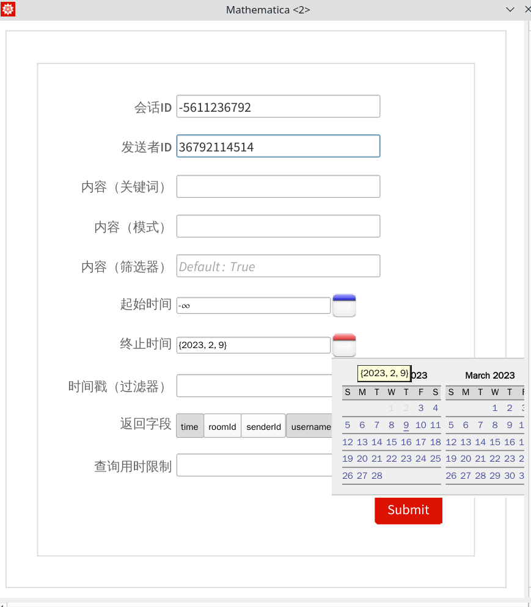

# Wolfram-IcalinguaUtils

This is an utility package for [Icalingua++](https://github.com/Icalingua-plus-plus/Icalingua-plus-plus) written in Wolfram Language [^1] (also known as Mathematica).

Now it creates a GUI for message searching, utilizing  `RelationalDatabase` support in WL for SQLite.

[^1]: which has a huge runtime so you won't wanna try if you don't need its many other functionalities

## Preview



## Usage

### Install

Evaluate this:

```
PacletInstall["IcalinguaUtils", "Site" -> "https://github.com/rnotlnglgq/Wolfram-IcalinguaUtils/raw/master"]
```

### Message Search

Evaluate this:

```
$MessageSearchApp
```

## TODO

* Check identity of `EntityStore`s instead of reloading them everytime.
* Adjust some notebook options.
